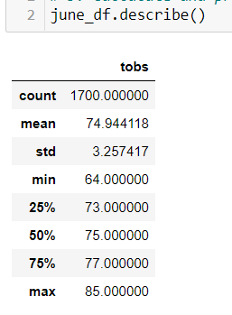
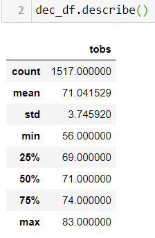

# Surf's Up Ice Cream and Surf Shop Analysis

## Overview of Analysis
The purpose of this analysis was to understand if a surf shop and ice cream parlor are viable year-round buisnesses in Oahu. In order to understand at a high level if these businesses could be successful, we extracted and filtered temperature data in June and December in order to analyze if the climate was suitable for these types of businesses. You can see the summary of these extractions and filters below.

  


## Results of Analysis
The temperature analysis allows us to make the following points regarding the temperature in Oahu:

* The mean temperature in June is 74, and in December is 71. Given the proximity of these temperatures to one another one can expect similar demand for both surfing and ice cream

* The max temperature in June is 85, and in December is 83. Again, both max temperatures are very similar, and neither are too extreme to likely cause residents or tourists to stay indoors or prefer inactivity due to heat.

* The standard deviation for both June and December are around 3-4 degrees, demonstrating a stable and consistent climate that lacks major extremes that would prohibit ice cream or surfing sales.

Summary of analysis data:

  

---

## Summary of Analysis
Based on the high level temperature analysis, it appears that both a surf shop and an ice cream parlor would be suitable businesses in Oaha year round due to the similar temperatures year round and lack of extreme temperatures and variances. To understand this even further, one could look into two further queries:

* 12 month analysis of temperature to ensure that other months don't show data that would not support the summaries of June and December. 

* Hourly temperature research could inform us not only when the best hours to open the shops are, but if market data is available we could also maximize efficiencies by ensuring we aren't open during hours that people are not shopping for surf items or ice cream.


```bash
Kyle Schneider, 11/1/2020
```
